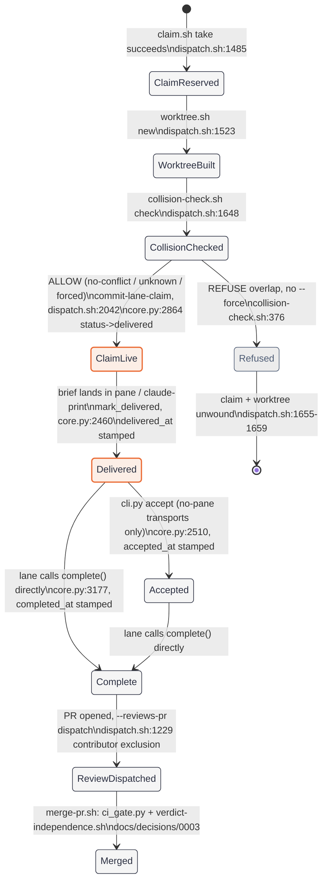
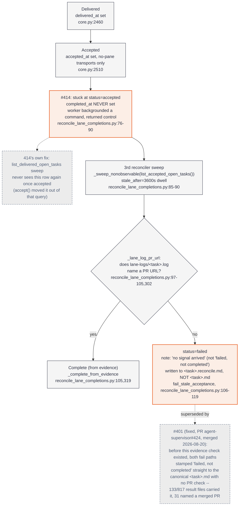
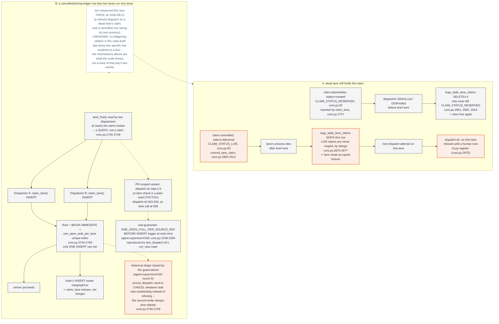
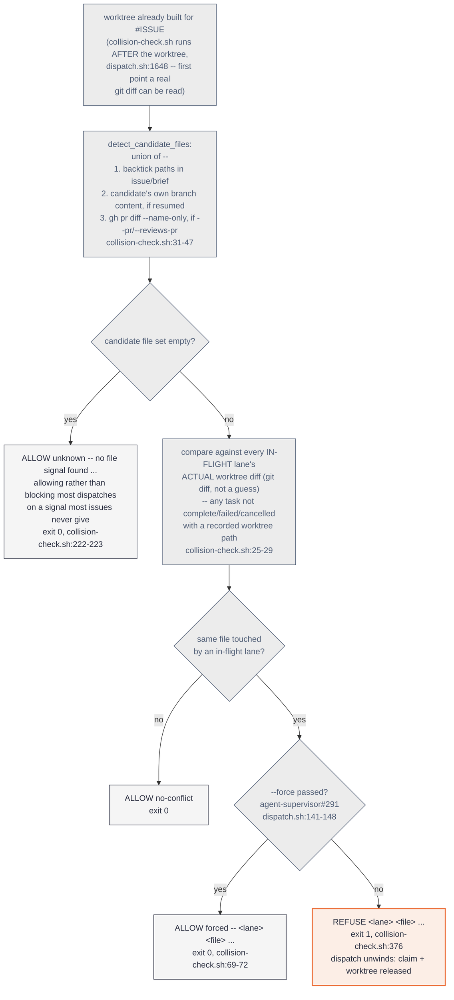
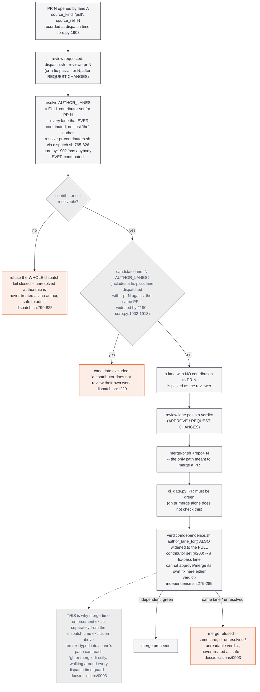

# The dispatch path

`2026-08-21`, first of three diagrams (loop-and-its-guards and memory are
next — jonhill90/agent-dotfiles#299).

Jon asked: *"Do we have any docs that tell me how these things work, with
charts or diagrams and such."* Measured answer: `docs/` in this repo and
`agent-dotfiles` together carry roughly 1,500 lines of prose about the
dispatch path and zero committed diagrams. This is the first one.

**Every diagram below is Mermaid, rendered from the code cited beside each
node — file and line number, checked against `origin/main` at commit
`14c2904` on 2026-08-21.** Where a path could not be traced to a specific
line, it says so instead of drawing a clean arrow. The happy path is five
boxes; the failure exits are the point, and they take up most of this
page on purpose.

## Where this lives, and why

This diagram lands in `agent-supervisor/docs/`, not `agent-dotfiles/docs/`,
for one reason: **every citation on this page points at a script in this
repo.** `docs/decisions/0003-independent-review-required.md` already
documents part of the mechanism diagram 5 draws (the merge-time
independent-review gate) — keeping this page beside it means both can be
reviewed and kept honest in the same PR whenever `dispatch.sh`,
`core.py`, or `verdict-independence.sh` change. `agent-dotfiles/docs/`
holds prose about the *estate* (harness config, skill roster, PRD/SPEC for
`agent-dotfiles` itself) — none of it currently cites a line number in
this repo, and adding a diagram that does would put the thing most likely
to go stale (line numbers in a file that changes constantly — 2,471 lines
in `dispatch.sh` alone, patched dozens of times in the last month) in a
different repository from the code it describes, with no shared CI to
catch drift. Docs-code proximity wins here even though it means Jon has
to know to look in two repos for "how do the lanes work" — the tradeoff
this page's own existence is arguing against on the *prose* side, but the
diagram's job is to stay true to the code, and that job is easier one
repo over.

---

## 1. The happy path, and where each guard sits

The ledger's own status enum (`core.py:24,28`):
`TERMINAL_STATUSES = ("complete", "failed", "cancelled")`,
`SOURCE_TASK_STATUSES = ("created", "delivered", "accepted", "running",
"complete", "failed", "cancelled")`. A claim placeholder reuses the same
column: `CLAIM_STATUS_RESERVED = "created"`,
`CLAIM_STATUS_LIVE = "delivered"` (`core.py:82-83`) — the two coral states
above are the same status value doing two different jobs, which is exactly
what diagram 3 goes wrong.

**Ordering note, confirmed by reading the script rather than assumed:**
the collision check runs *after* the worktree is built (`dispatch.sh:1648`,
step 3.2), not before the claim. It has to — `_files_changed_in_worktree`
needs a real `git diff` to read, and that diff does not exist until the
worktree does (`dispatch.sh:1634-1636`). A refusal at that point unwinds
both the claim and the worktree (`dispatch.sh:1655-1659`) — the estate is
left exactly as it found it, not holding a half-built lane.

**Caveat: that unwind is unconditional for the claim, not for the
worktree.** `abort_send` (`dispatch.sh:1562-1584`) always releases the
lane claim, but only tears down the worktree when `cleanup_worktree`
stays `1`. If the lane's own pane still appears to be inside `$WORKTREE`
and `dispatch_rehome_lane` cannot move it out, `cleanup_worktree` is set
to `0` and the worktree is deliberately left in place with a
`--rehome-lane` recovery hint printed to the operator (`dispatch.sh:1571-
1573`) — "the estate is left exactly as it found it" holds for the claim,
not for the worktree, in that one case.

---

## 2. #414 and #401: where `delivered_at` and `completed_at` diverge

**#414's exact shape** (`reconcile_lane_completions.py:76-90`): `accept()`
is the one place `status` ever becomes `'accepted'`
(`Ledger.list_accepted_open_tasks`'s own docstring). A `claude-print` or
`pi-rpc` worker that gets far enough to call `cli.py accept` moves its row
out of `list_delivered_open_tasks` — the query every earlier sweep reads —
and if that worker then backgrounds a long-running command and returns
control without ever calling `complete()`, `delivered_at` and
`accepted_at` are both stamped, `completed_at` never is, and nothing was
watching that row anymore. Measured live: five `claude-print` dispatches
sat at `status=accepted` for 2+ hours, zero commits, zero comments.

**#401 is fixed, not open** — worth stating plainly, because the issue
brief describing this diagram was written against the defect, not the
fix. `git log --oneline --all | grep 401` on this repo turns up five
commits and one PR (`#424`, merged `2026-08-20T23:53:24Z`) closing it. The
code today runs the evidence check shown above *before* either failure
path stamps anything (`reconcile_lane_completions.py:92-119`), and the
verdict — when there is genuinely no PR evidence — no longer claims the
work failed, only that no signal arrived, written to a sibling
`.reconcile.md` path so a late, genuine `complete()` from the lane itself
is never rejected by finding its canonical slot already taken
(`_write_result`'s `suffix` parameter, same file). Drawing the pre-#401
behavior as live would be exactly the failure this brief warns against —
disagreeing with the code — so it is shown dashed, as history the fix
replaced, not as a path #401-numbered issues can still take today.

---

## 3. A claim that outlives its lane

**Subcase A is a deliberate asymmetry, not an oversight.**
`reap_stale_lane_claims` (`core.py:2961`) only deletes rows still in
`CLAIM_STATUS_RESERVED` (`core.py:2992`, `2961-3019`) — a claim that
reached `CLAIM_STATUS_LIVE` via `commit_lane_claim` is never reaped even
when its owner process is provably dead, because "the owner is dead" does
not by itself distinguish "claim taken, nothing sent" from "claim taken, a
brief is live in the pane" (`core.py:2864-2880`, `commit_lane_claim`'s own
docstring). The cost of that asymmetry is exactly the shape Jon measured:
a dispatch refused because a dead lane's *live* claim cannot be
auto-cleared, and needs `cli.py register` run by a human.

**Subcase B, the mechanism is real and closed at two different layers,**
but I could not trace either of *today's* two specific incidents to a
log line or ledger row cited in the code — the code shows what the
guard does and what it replaced, not a record of a particular race on
2026-08-21. Marked unknown (dashed) rather than guessed. What the code
does show: the plain-lane race is closed at the write (`claim_lane`'s
atomic `INSERT` under `flock` + `BEGIN IMMEDIATE` +
`one_open_task_per_lane`, `core.py:2754-2760`) — the historical failure it
replaced is named in the same docstring: `record_dispatch` used to
*cancel* whatever task was already outstanding rather than refuse the
second writer, so "the second writer always wins silently" (measured,
`agent-supervisor#183` round 3, `core.py:2746-2749`). The PR-scoped
variant is a second, later fix: `dispatch.sh`'s own step 0.6 (`pr-lane`
check) is admitted in its own comments to be a plain read with a real,
multi-second TOCTOU window (`dispatch.sh:903-934`, the `pr-lane` call
itself at line 938) — what actually closes
that race is the `ONE_OPEN_PULL_PER_SOURCE_REF` trigger firing at INSERT
time (`agent-supervisor#169`, `core.py:1038-1094`), reproduced directly by
`test_dispatch.sh`'s own `run_race` case: two full dispatches, two lanes,
one PR, both `delivered`, and the second writer's `INSERT` now fails as a
unique-index violation instead of silently winning.

---

## 4. The collision check, and "ALLOW unknown"

**"ALLOW unknown" is not "safe."** It means none of the three
file-detection signals fired: no backtick-quoted path in the issue or
brief that resolves via `git ls-files`, no prior content on the
candidate's own branch, and no PR diff to read. `collision-check.sh`'s own
header states the reasoning plainly (`collision-check.sh:54-62`, quoting
the originating issue): *"If the file set cannot be determined: say
UNKNOWN, ALLOW the dispatch, and log it."* Most issues never name a file,
so refusing on unknown would refuse nearly every dispatch — the one place
this script's usual fail-closed posture deliberately inverts, and only for
the *candidate's* side; an in-flight lane whose own worktree cannot be
read is simply skipped for that one lane (`collision-check.sh:58-62`), not
treated as making the whole check unknown. What overlap actually means
here is whole-*file* overlap only — not line-range or hunk-level, a
predictive signal this estate rejected once already
(`collision-check.sh:12-23`).

---

## 5. Independent review — and why a fix lane is not one

**A fix lane is not an independent review, and the code says so twice, at
two different layers, because one layer alone was proven not to hold.**
`dispatch.sh`'s `AUTHOR_LANES` set (built by resolving *every* lane that
ever contributed to PR N, not narrowed to a single "the author") already
excludes a fix-pass lane from being dispatched to review that same PR —
widened by `agent-supervisor#190` specifically because a narrower
single-author lookup missed exactly this case: *"a FIX-PASS task
dispatched against the same issue to address review findings is a second,
later contributor to the same PR"* (`core.py:1902-1913`). But dispatch-time
exclusion only governs who gets *assigned* a review — it does nothing
about a prompt typed directly into a lane's pane that reaches `gh pr
merge` without going through `dispatch.sh` at all
(`docs/decisions/0003-independent-review-required.md`). That is why
`merge-pr.sh`'s own `verdict-independence.sh` recomputes the same
contributor set independently at merge time (also widened to include a
fix-pass lane, by `agent-supervisor#200`,
`verdict-independence.sh:279-289`) rather than trusting that dispatch
already enforced it — `merge-pr.sh` is, in its own words, "the one place
in the system that cannot be skipped by habit."

---

## Sources

Every citation above is checked against `jonhill90/agent-supervisor`
`origin/main` at commit `14c2904` (2026-08-21):
`scripts/supervisor/dispatch.sh`, `claim.sh`, `collision-check.sh`,
`core.py`, `reconcile_lane_completions.py`, `merge-pr.sh`,
`verdict-independence.sh`, and `docs/decisions/0003-independent-review-required.md`.

`lane-done.sh` is a *third* path into `Complete`, not drawn as a separate
node above to stay inside the diagram's own budget: it runs in the
supervisor's pane (not the worker's) when a `wait-for` channel signals
that a still-correctly-named window finished, and calls `cli.py
record-completion` rather than `cli.py complete` — no `TMUX_PANE`
ownership check, no `--result-file`, authenticated instead by the task's
own recorded `pane_nonce` (`cli.py:1067-1112`, `lane-done.sh:180-192`).
`record_completion`'s own docstring is explicit that this still resolves
to `Ledger.complete` (`core.py:3177`, the same terminal transition cited
in diagram 1) — but it also states one thing this path does NOT do that
the worker-driven path does: no `completion:<task>` notification event
reaches the supervisor lane through this route (`cli.py:1079-1083`). That
is a real, cited gap this page is marking rather than smoothing over: a
completion recorded this way is durable in the ledger but silent to
whatever reads that notification channel.
