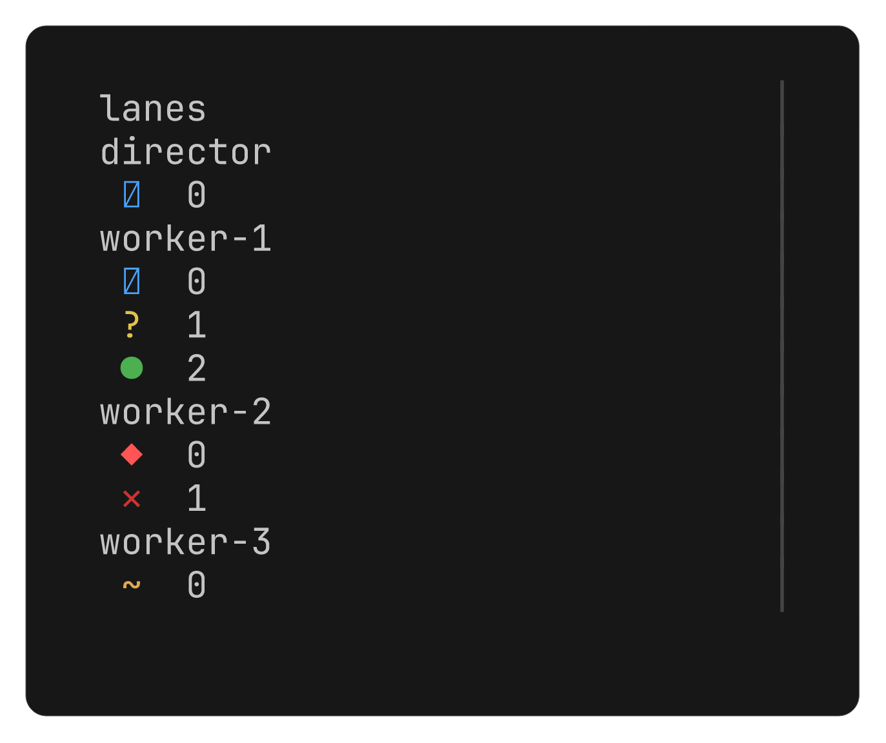
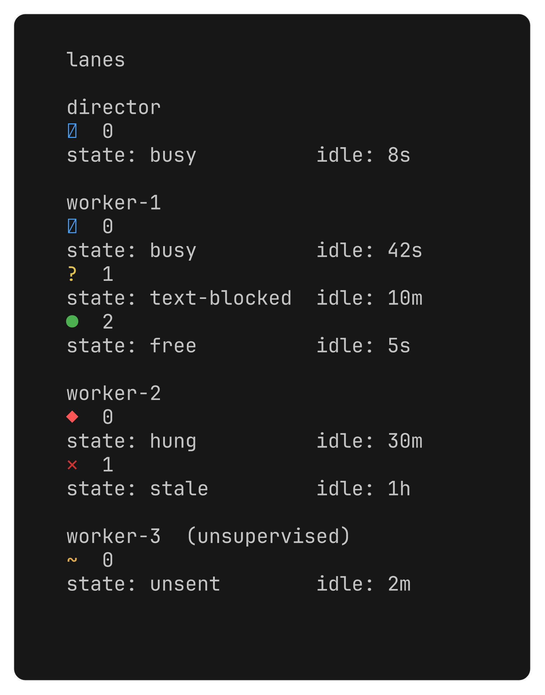
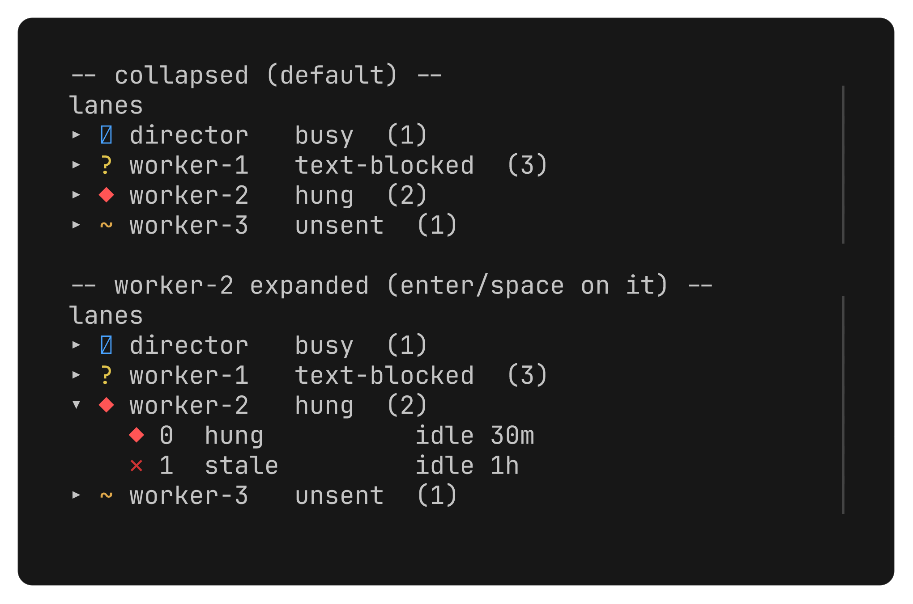
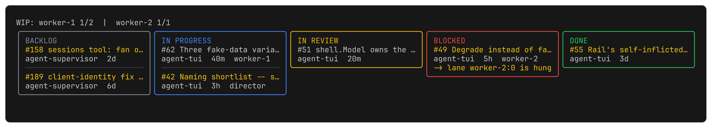
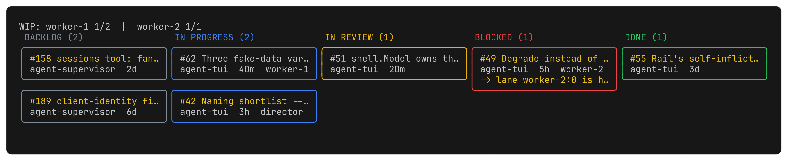
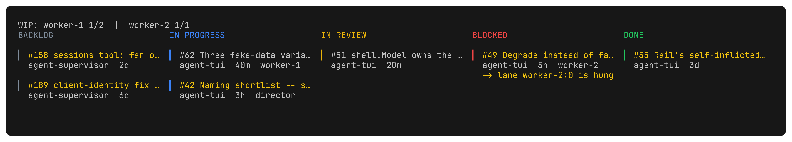

# agent-tui#62: rail + board UI variants

Six images, real Bubble Tea/lipgloss output over hardcoded fake state (no
supervisor, no MCP, no ledger, no `gh`) -- not an HTML mock. See
`tools/uivariants/main.go` for the code that produced these and
`scripts/render-uivariants.sh` for how (`freeze --execute` capturing a real
terminal frame, same renderer/font/colour depth the shipped app uses).

Jon's QA answers this responds to:
**Q1 = 2, the rail is too dense** -- breathing room, not more information.
**Q2 = 2, the board's structure is right and its looks are wrong** --
colour per column, rounded cards, spacing. Board structure (the five
`board.Columns`, grouping, every `Card` field) is unchanged across all
three board variants -- only the decoration differs.

Cycle through in one pass, pick one per row (or none -- say what's still
wrong with all three and this gets another pass).

## Rail -- the axis is density

| | |
|---|---|
|  | **1. Thin** -- removes fields (glyph + name only, no state word/idle/legends). Implies: fastest scan, but a lane's WHY needs a keypress, not a glance. |
|  | **2. Roomy** -- keeps every field the shipped rail shows, spends whitespace instead of borders/density. Implies: same knowledge, gentler feel, fewer lanes fit without scrolling. |
|  | **3. Collapsed sessions** -- progressive disclosure: every session rolls up to one line (worst state + count) until expanded. Image shows both ends of the interaction (collapsed, then worker-2 expanded). Implies: scales to many sessions without growing dense, but a lane's real state is one keypress deep, not always visible. |

## Board -- the axis is decoration (colour, card treatment, spacing)

| | |
|---|---|
|  | **1. Boxed columns, ruled cards** -- closest to what ships today: one rounded, colour-per-column box, cards inside separated by a rule instead of a border. Implies: cheapest change from today, but still reads as five lists more than five stacks of cards. |
|  | **2. Per-card rounded boxes** -- no column border, each CARD gets its own rounded box coloured by column. Implies: reads instantly as a kanban card, costs vertical space so fewer cards fit per column without scrolling. |
|  | **3. Colour-chip cards** -- no border characters anywhere; a coloured left bar (`▎`) per card plus generous blank-line spacing carries the whole board. Implies: quietest option, most cards visible at once, but nothing marks a column's edge except its header word. |

## Regenerating

```
./scripts/render-uivariants.sh
```

Requires `go` and Charm's `freeze` (https://github.com/charmbracelet/freeze)
on `PATH`. Writes all six PNGs into this directory.

## Disposition

`tools/uivariants/` is throwaway -- hardcoded fake data, no live wiring, not
imported by `cmd/` or `internal/`. Once a variant is picked, it gets
rebuilt as a real `internal/rail`/`internal/board` change against live
data; nothing here gets promoted as-is. Delete `tools/uivariants/` and this
directory once the pick is made and the real change has landed.
