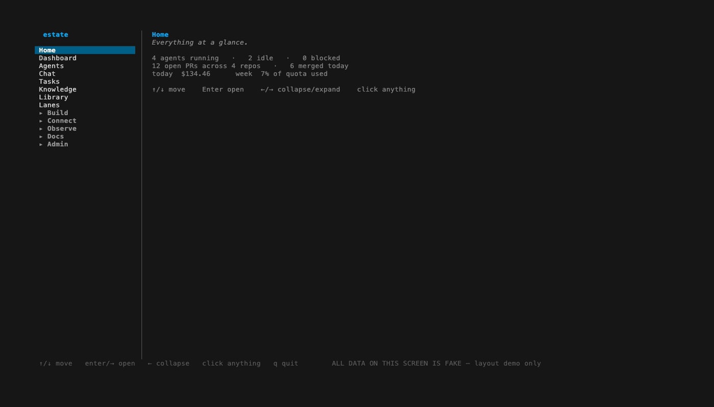
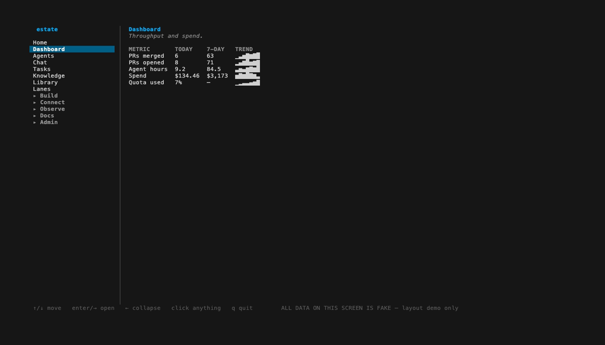
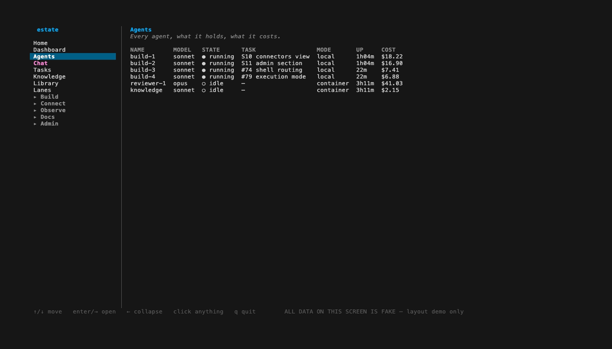
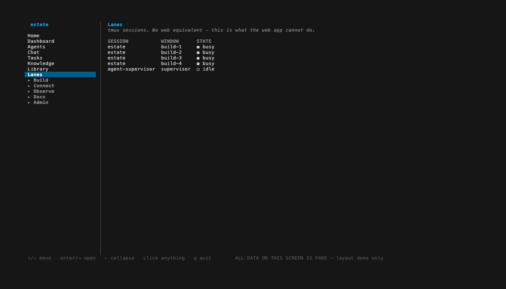
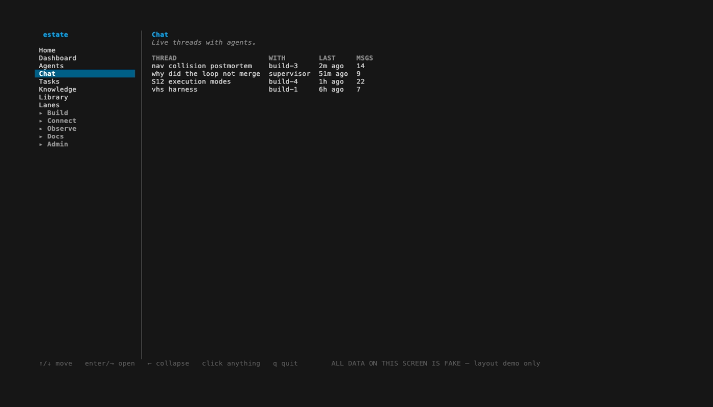
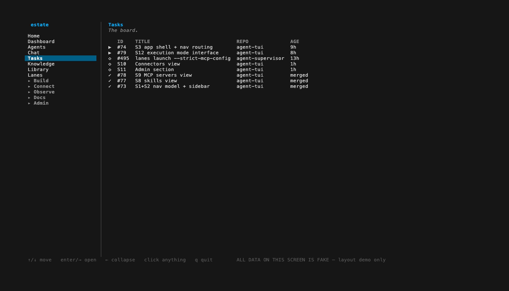
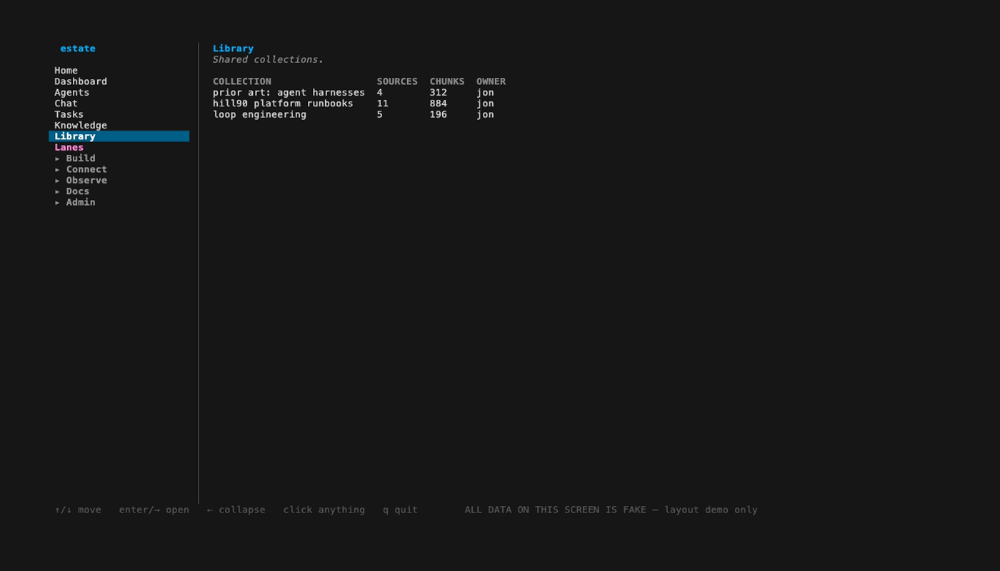

# agent-tui

**The product is the Estate**, binary `estate` (see `AGENTS.md`'s naming
note for the full history: `keelson`, rejected agent-tui#42 for a real
collision; `steading`, chosen agent-tui#42 as a prose-only name while the
module path and binary stayed `keelson`; the Estate, chosen 2026-08-23,
which finally moves the module path and `cmd/` directory to match and
retires both earlier names). The GitHub repo stays `jonhill90/agent-tui`
deliberately — repository visibility and the repo's own name are Jon's
separate, reserved calls, not part of this rename.

A terminal application for the agent estate: reads [`agent-supervisor`](https://github.com/jonhill90/agent-supervisor)'s
lane and session state over MCP and renders it behind a persistent left
rail, with the task board, cost panel and glyph gallery reachable as panes
in the same process. Go + [Bubble Tea](https://github.com/charmbracelet/bubbletea).

**False as of `56513a2`, corrected 2026-08-23 (estate-loop/b-docs-stale
sweep, pass 2) — same staleness as "What it is today" below, missed here
on the first sweep pass.** The "persistent left rail" framing is the
pre-`docs/SPEC-shell.md` architecture. The fixed left column today is
`internal/nav`'s sidebar, modelled 1:1 on the hill90 web app's own nav; the
rail is a routed pane behind that sidebar's "Lanes" entry, and the content
reachable as panes now spans board/cost/gallery/chat plus roughly twenty
more destinations (agents, skills, MCP servers, connectors, admin,
dashboard, library, monitor, workflows, knowledge, API/platform docs,
secrets) — see "What it is today" below for the full correction and
`AGENTS.md`'s Layout table for the complete list.

It consumes the supervisor; it does not import supervisor internals, and the
supervisor has no opinion about how a human sees it. Either side is
removable. Full technical design: `docs/SPEC.md`. What the product is for:
`docs/PRD.md`. Arrival policy for an agent working in this repo: `AGENTS.md`.

**This section describes what is actually on `main`, checked against
`b00db9b`.** Where intent and code diverge, that is said explicitly — see
"What this is not, yet" below, and "Known defects" further down for what
is on `main` but does not work correctly yet.

**Stale, partially corrected 2026-08-23 against `390c99a`
(estate-loop/b-docs-stale, docs-stale-sweep worktree).** This README is
~35 commits behind `b00db9b` and describes the pre-nav-sidebar
architecture throughout; this pass corrects the specific sections flagged
below in place (architecture/rail, chat's live Source, Known defects,
knowledge viewer) rather than rewriting the whole file — a fuller
re-verification pass against `390c99a` is still needed and is explicitly
out of scope here. Sections not flagged below were not re-checked in this
pass.

## Screenshots

These are the real shell's real rendering code (`internal/nav`, the same
sidebar and pane layout `estate` ships), driven by `cmd/demo` — a build
wired to invented data instead of live sources, so every frame carries an
"ALL DATA ON THIS SCREEN IS FAKE" footer and none of it is mistakable for
a real estate's state. Home alone is the least informative screen in the
app, so Dashboard, Agents, Lanes, Chat, Tasks and Library are shown
instead — the destinations with real column data rather than a bare
placeholder. Regenerate them with:

```
vhs testdata/vhs/readme-demo.tape
```

| Home | Dashboard |
|---|---|
|  |  |

| Agents | Lanes |
|---|---|
|  |  |

| Chat | Tasks |
|---|---|
|  |  |

| Library |
|---|
|  |

## What it is today

**Stale, corrected 2026-08-23 against `390c99a`.** The "persistent left
rail" description below is the pre-`docs/SPEC-shell.md` architecture.
`internal/nav.Model` (a sidebar modelled 1:1 on the hill90 web nav) is now
the fixed left column; `internal/rail` is reached as a routed pane
(`PaneLanes`, behind the sidebar's "Lanes" route) rather than always being
on screen — see `docs/SPEC-shell.md`'s S1-S3 and `AGENTS.md`'s Layout
table. The paragraph below is kept for the flags/keys it still documents
correctly but its "persistent left rail" framing is no longer current.

**One `tea.NewProgram`, one process.** `internal/shell.Model` owns a
persistent left rail (every tmux session, live lane state) plus a content
pane that holds the task board, cost panel, glyph gallery or chat —
reached with a keypress, never a relaunch (agent-tui#38). `-board`/`-cost`/
`-gallery`/`-chat` still choose which pane the app *opens* on; they stop
being the only way to reach it.

```
go build -o estate ./cmd/estate

# opens on the rail with the home pane -- [f2] board, [f3] cost, [f4] gallery,
# [f5] flow, [f6] chat -- [tab] moves focus between the rail and the content pane
AGENT_SUPERVISOR_REPO=/path/to/agent-supervisor ./estate

# same app, opens on the task board pane -- needs a ledger COPY
AGENT_SUPERVISOR_REPO=/path/to/agent-supervisor ./estate -board \
  -ledger /path/to/a/COPY/of/ledger.sqlite3

# same app, opens on the cost pane
AGENT_SUPERVISOR_REPO=/path/to/agent-supervisor ./estate -cost

# same app, opens on the glyph gallery pane
AGENT_SUPERVISOR_REPO=/path/to/agent-supervisor ./estate -gallery

# same app, opens on the chat pane -- fixture threads today, see below
AGENT_SUPERVISOR_REPO=/path/to/agent-supervisor ./estate -chat
```

The rail is always on screen now, so every invocation needs a supervisor
connection (`-supervisor-repo`/`$AGENT_SUPERVISOR_REPO`/`-mcp-cmd`) — even
one that opens on the cost or gallery pane, which is a change from the
four-separate-programs era, when `-cost`/`-gallery` needed no connection at
all because there was no rail beside them to feed.

Run `./estate -h` for every flag; `cmd/estate/main.go`'s flag help
strings are the authoritative, current documentation for each one — this
README does not restate them.

### The rail (default screen)

**Stale, corrected 2026-08-23 against `390c99a`:** the rail is no longer
the default screen or a fixed left-anchored column — the nav sidebar
(`internal/nav`) is the fixed left column now, and the rail is reached via
the sidebar's "Lanes" route (`PaneLanes`). The rail's own render/key logic
described below is otherwise unchanged (`scripts/verify-lanes-unaffected.sh`
is the checked proof of that).

A left-anchored navigation rail (~28 columns, `rail.RailWidth`), driven
entirely by the supervisor's `sessions` and `lanes` MCP tools. No second
reader of tmux, no ledger access beyond the optional per-lane task text.
Every state in `internal/lane/states.go`'s `AllStates` (counted, not
hardcoded here — 14 as of `d5e4dab`; `internal/lane/variants.go`'s
`init()` guard checks the same list, so a state added later can't fall out
of sync with this doc) animates distinctly: a spinner on `busy`, a settled
dot on `free` (`dead`, `service`, `supervisor`, and `unknown` are also
`MotionStill`), glitch motion on `hung`/`broken`, pulse on `stale` and the
blocked states — so a wrong state reads as wrong at a glance rather than
requiring the word to be read. Not verified against a live rendered
session — this is read from `signalSet`'s `Motion` field per state, not
watched as animated frames. Sessions are grouped,
`director` styled distinctly (`★`, gold accent), with an interim
supervised/unsupervised marker per session.

**Anchor-feature status:** `[n]ew` and `[x]remove` are wired and tested
through `Model.Update`. `[a]ttach` and `[d]etach` are **not currently
bound to any key** — they were removed in `3137206` because MCP's stdio
transport gives the supervisor no client identity to attach/detach
correctly, so the old bindings silently acted on an arbitrary tmux client
while reporting success. `session.Interface` still declares both methods;
`agent-supervisor#189` tracks the fix this needs before they can come back
honestly. See `AGENTS.md` and `docs/SPEC.md` for the detail.

**Status update, 2026-08-23 (estate-loop/b-docs-stale sweep, pass 2):**
`agent-supervisor#189` is closed (fixed by `agent-supervisor#202`,
merged) — the supervisor-side client-identity fix this paragraph names as
the prerequisite now exists. The keys are still not restored (zero
`.Attach(`/`.Detach(` callers, re-confirmed against `56513a2`); the
remaining work is on the agent-tui side, not a wait on the supervisor.

Live pickers, all driven by real keys against real state (verified through
`Model.Update` tests, not merely rendered):

- **`[1-2]`** cycles the glyph set — `signal` (default) or `nerd` (Font
  Awesome glyphs via a Nerd Font's Private Use Area, flagged `[NF]` in the
  gallery). `ascii`, `blocks`, and `emoji` were judged live against a
  running rail and deleted outright, not merely deprioritised —
  `internal/lane/variants.go`.
- **`[g]`** cycles session grouping (flat-with-headers / indented tree).
- **`[w]`** cycles the rail's content reading between work-centric and
  status-centric (`internal/rail/readings.go`).
- **`[t]`** cycles the active theme in memory, live — never persists; see
  "Themes and glyphs are data" below.

### The task board (`-board`)

A second screen: five columns (Backlog, In progress, In review, Blocked,
Done), grouped by repo, across every repo the estate touches. A card's
column is recomputed fresh on every fetch from three real sources —
`gh issue|pr list` (intent), the ledger's `tasks`/`source_tasks` tables
(opened `sqlite3 -readonly`, never the live file), and the live `lanes` MCP
payload (blocked detection) — never stored as a fourth store. Six layout
variants (`[1-6]`), picked live (not verified against a live session for
this doc — read from the `Layouts` literal in `internal/board/layout.go`,
not watched rendering): boxed columns vs. thin rules vs.
whitespace-only, single-line vs. multi-line cards, restrained vs. vivid
colour, by-column vs. by-repo swimlanes. Project selection (`[a]`, `[b]`,
...) filters the already-fetched snapshot without a new read. `-ledger`
must point at a copy — `-board` refuses to start otherwise, and the read is
always `sqlite3 -readonly` regardless.

### The cost panel (`-cost`)

Per-harness spend and quota pressure from `ccusage`, with an explicit
"unknown" instead of a fabricated zero wherever `ccusage` cannot see a
figure (`cost.Figure.Known`) — including quota buckets `ccusage` genuinely
has no local way to compute (verified against `ccusage codex --help` /
`ccusage pi --help`: no `blocks`/token-limit concept for those harnesses).
Needs no supervisor connection. A compact form of this panel already
renders inside the rail's default view (`cost.RenderCompact`) — the one
place today where two screens are actually composed together.

### The glyph gallery (`-gallery`)

Every state in `AllStates` (14 as of `d5e4dab`) against every candidate glyph,
flagged `[NF]` where a Nerd Font is required to render as intended. Needs
no supervisor connection; reads only compiled-in glyph data
(`lane.Variants`, `lane.Candidates`).

### Chat (`-chat`, `[f6]`)

Threads as ACP sessions, live via `session/update` (agent-tui#20) — a
thread renders thoughts, tool calls, plans and permission requests as
those structures, never flattened to prose. Two layouts (`[v]` cycles),
collapsing the issue's four design options into the two that are
structurally different renderers (see `internal/chat/layouts.go`'s doc
comment for why the other two are readings of these, not new screens):

- **Thread list** (default): sessions on the left, the selected thread's
  transcript on the right. The list's first row is always a synthetic
  "All (unified)" thread interleaving every real thread chronologically —
  the issue's "unified activity feed" option, one keypress away rather
  than a third screen.
- **Multi-pane** (`[v]` again): every thread tiled and live at once —
  the direct answer to "see the agents chatting with each other" plural.
  `[f]` focuses the selected tile into the same scrollable single-thread
  view the list layout uses, with the rest as a compact peripheral strip
  (the issue's "focus + peripherals" option).

The thread list and the transcript both scroll (`bubbles/viewport`) rather
than clipping silently — `[pgup]`/`[pgdn]`, `[home]`/`[end]` move the
transcript, `[j]`/`[k]`/`[n]`/`[p]`/`[1-9]` move thread selection with the
list auto-scrolling to keep it visible. Any pane with content past its
edges renders an explicit "▲/▼ more" or "N more -- [f] to focus" marker —
never a pane that is quietly shorter than its own content, the exact shape
of agent-tui#29's board-scroll regression.

**No live `Source` yet.** `chat.FixtureSource` (visibly synthetic data) is
the only implementation shipped: no lane in this estate runs on a
structured transport (`acp`/`pi-rpc`) today, and a screen-scraped
send-keys transcript has no message boundaries to recover into ACP's
structured shape — see `internal/chat/fixture.go`'s doc comment for what a
real `Source` needs.

**False as of `390c99a`, corrected 2026-08-23.** `agent-tui#99` (commit
`5997399`) shipped `internal/chat/claudecode.go`'s `ClaudeCodeSource`,
which reads real Claude Code CLI session transcripts, and
`internal/chat/fallback.go`'s `FallbackSource`, which `cmd/estate` wires
in: try `ClaudeCodeSource` first, fall back to `FixtureSource` only when
the real source reports itself genuinely unconfigured. `FixtureSource` is
now the last-resort fallback, not the only implementation. Sending is also
now built (agent-tui#104, commit `6942926`): `chat.Sender` is implemented
over `session_send` (`agent-supervisor#509`) and wired into the composer —
see `docs/SPEC-shell.md`'s S7 for the fuller history.

## Themes and glyphs are data, not code

Every look-and-feel literal in the render path — colour, border character,
chrome padding, the director's `★` mark — lives in `internal/theme` as a
`theme.Theme` value keyed by semantic `Role` (`RoleError`, `RoleDirector`,
`RoleSelectedBG`, ...). `internal/board`, `internal/rail`, `internal/cost`
and `internal/gallery` ask for a role at render time; none names a hex
value. Two themes ship: `signal-dark` (default) and `mono-contrast` (a
high-contrast theme that exists to prove the routing works, not for daily
use). Changing the whole look is a one-line edit to
`$AGENT_TUI_THEME_CONFIG` (or `$XDG_CONFIG_HOME/agent-tui/theme.json`):

```json
{"theme": "mono-contrast"}
```

or an optional per-role colour override layered on top:

```json
{"theme": "signal-dark", "colors": {"error": "#ff0000"}}
```

A missing config renders exactly as before this existed. A malformed config
or unknown theme name renders the default theme and **says so visibly** —
never silently — and, as of `d5e4dab`, a single bad colour entry drops only
that entry (with a notice naming the role) rather than discarding the whole
file. `[t]` cycles themes at runtime in every screen, live against whatever
is already on screen; it never calls `theme.Save`, so a user's own config
file is untouched until they edit it themselves.

Glyph sets follow the identical pattern one level down, governing which
rune animates which lane state rather than the chrome around it — see
`internal/lane/variants.go`.

## Known defects

**All three closed, `6942926`, 2026-08-23 (agent-tui#49 closed 2026-08-16).**
See `AGENTS.md`'s own "Known defects" section for the fix evidence
(`cmd/estate/main.go`'s `supervisorRepoResolved` handling for the bare
launch, `resolveLedgerSource`/`defaultLedgerLivePath`/`newLedgerCopier` for
the board pane, `internal/cost/quota.go`'s `QuotaRunner`/`ExecQuotaRunner`
wiring for the quota line) — kept below for record, not as an open list.

Recorded at agent-tui#49 (open), found by driving the actual binary, not by
reading the source. Confirmed still present at `b00db9b`, 2026-08-16:

- **Bare launch exits 1 instead of opening.** `./estate` with no flags and
  no `$AGENT_SUPERVISOR_REPO` set prints `no supervisor to connect to: set
  -supervisor-repo, $AGENT_SUPERVISOR_REPO, or -mcp-cmd` and exits 1. Jon's
  stated acceptance criterion is that the bare command opens the app; this
  has already caused one false "it doesn't work" conclusion (with a
  different script) and would repeat it here. Verified: `go build -o
  /tmp/estate-check ./cmd/estate && /tmp/estate-check` exits 1.
- **The board pane says it's unavailable with no `-ledger`.** Reaching it
  by `[f2]` from inside the shell (as opposed to `-board`, which refuses to
  launch at all without `-ledger`) renders `! unavailable` / `no -ledger
  (or $AGENT_TUI_LEDGER) configured -- point it at a COPY of the ledger to
  use the board` (`cmd/estate/main.go`'s `boardUnavailable` string) rather
  than degrading further or explaining how to fix it in-pane.
- **The cost panel's quota line has no current quota source wired in.** It
  renders `unknown (no quota source)` for harnesses `ccusage` cannot
  compute a blocks/limit figure for, even though
  `scripts/supervisor/quota.sh` is the quota source now — confirmed by `grep
  -rn "quota.sh" --include='*.go' .` returning zero matches in this module.

## What this is not, yet

- **Chat has no live transport.** `internal/chat` is wired into the shell
  (`[f6]`, agent-tui#20) and renders against `chat.Source`, but the only
  `Source` shipped is `chat.FixtureSource` — visibly synthetic data. No
  lane in this estate runs on a structured transport (`acp`/`pi-rpc`)
  today, so there is nothing real to read yet; see the "Chat" section
  above for what a live `Source` needs.

  **False as of `56513a2`, corrected 2026-08-23 (estate-loop/b-docs-stale
  sweep, pass 2) — same correction as the "Chat" section above, missed
  here on the first sweep pass.** `chat.ClaudeCodeSource` (agent-tui#99)
  reads real Claude Code CLI session transcripts and is what `cmd/estate`
  actually wires in, falling back to `FixtureSource` only when genuinely
  unconfigured; sending is built (agent-tui#104) and Chat is a
  multi-participant room with `@`-mentions (agent-tui#114). This bullet's
  premise no longer holds.
- **No knowledge/memory viewer, no AgentBox sandboxes.** No code exists for
  either as of this SHA. **The knowledge-viewer half is false as of
  `390c99a`, corrected 2026-08-23:** `internal/knowledge` exists and is
  wired as `PaneKnowledge` (agent-tui#87, commit `922400b`) — Jon's own
  memory vault, reachable from the nav sidebar. The AgentBox half still
  holds for the container driver itself (no driver code exists), though
  `internal/session/execution_mode.go`'s `ExecutionMode`/`AddWithMode`
  interface has landed since this SHA — an interface, not a driver; see
  `docs/SPEC-shell.md`'s S12 for the current state.
- **The anchor feature is missing two of its four verbs** — see "The rail"
  above.

`docs/PRD.md` states what the product is for, including these; this
section exists so the distance between the two is never silently implied
to be zero.

## Design constraints, from measurement not taste

- **It renders in its own window. It never injects panes into live ones.**
  Measured on a real fixture: injecting a fixed-width pane into every
  window changed two lanes' classification, because the supervisor reads
  panes. A sidebar built that way corrupts the state it displays.
- **Acceptance for any renderer: `lanes.sh` output is byte-identical with
  the app running and not running.**
  `scripts/verify-lanes-unaffected.sh <agent-supervisor-repo> <estate-binary>`
  is the checked proof — it spins up an isolated tmux server, snapshots
  `lanes.sh --json`, runs estate in its own window of the same session,
  snapshots again, and diffs.
- **Every state the supervisor emits must be nameable.** A state with no
  glyph must not silently read as idle. `internal/lane/variants.go`'s
  `init()` refuses to start if a shipped glyph set doesn't cover every
  state in `internal/lane/states.go`'s `AllStates`.
- **Single static binary.** Mac and Linux today, Windows eventually, no
  runtime to install.

It spawns `python3 scripts/supervisor/mcp_server.py` from the given
`agent-supervisor` checkout as a child process and speaks MCP JSON-RPC over
its stdio — the same protocol Claude Code/Codex/Copilot use, not a private
wire format (`internal/mcp`). `-mcp-cmd` overrides the launch command
entirely, e.g. an SSH hop to a remote supervisor.

## Building and testing

```
go build ./...
go vet ./...
go test ./...
```

All three verified green at `b00db9b`, 2026-08-16. See
`AGENTS.md` for what CI runs beyond this (a supervisor-checkout-gated
cross-check of the lane-state table) and the adapter discipline that keeps
every package's tests running against fakes rather than real subprocesses.

## Repository split

This repo exists so the boundary between UI and orchestration is real from
the first commit rather than extracted later — `agent-supervisor` was split
out of `agent-dotfiles` only after it reached 25,000 lines, and a coupling
missed by that inventory (a default tmux session name) survived a full day
past the split.
