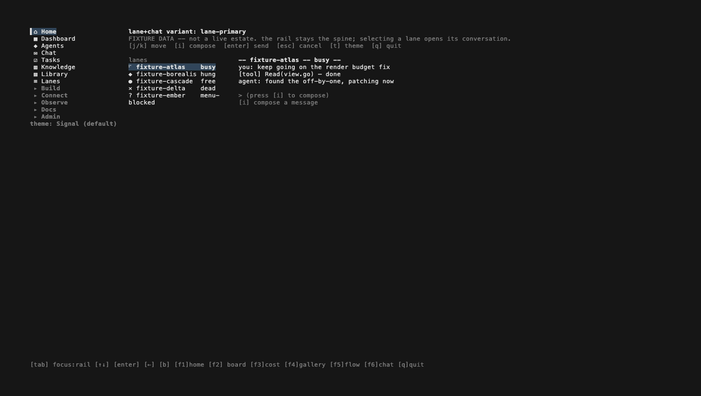
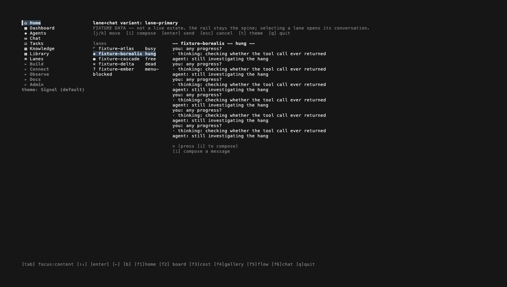
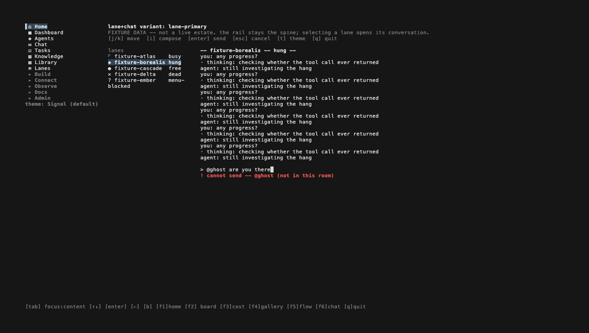
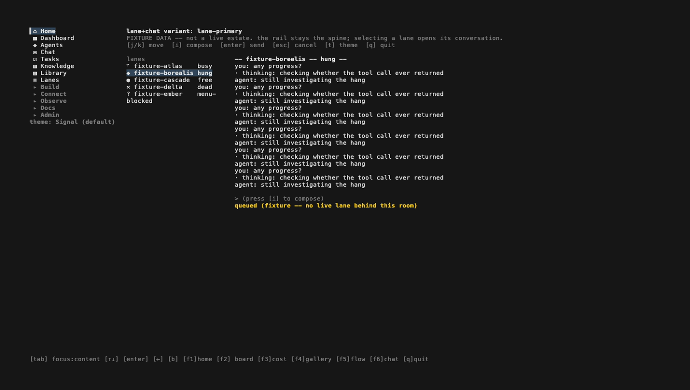
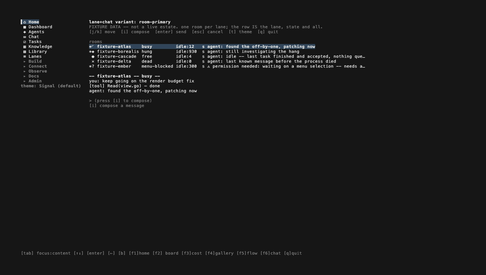
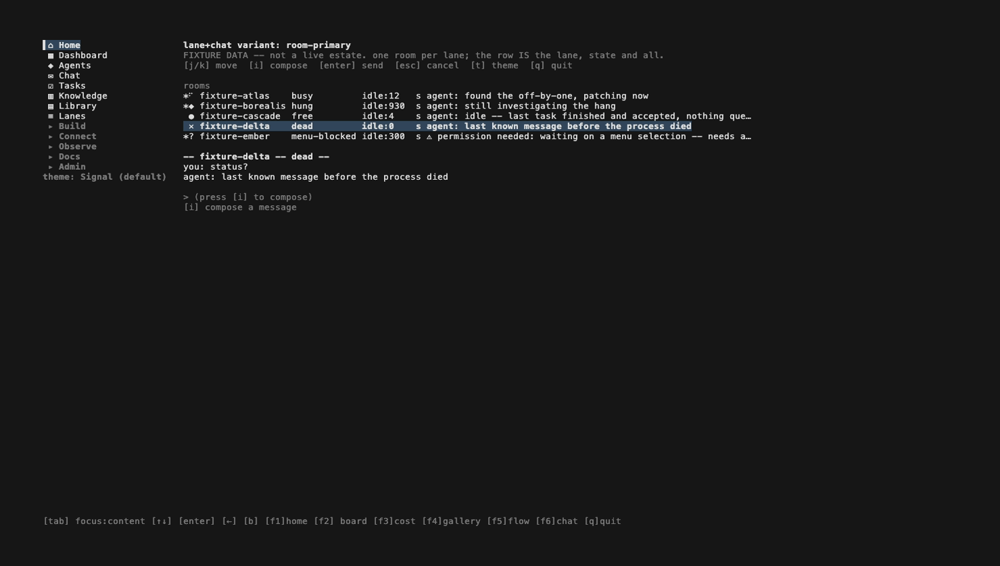
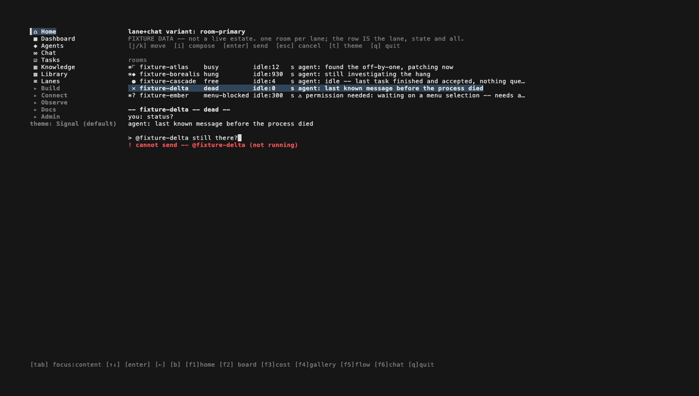
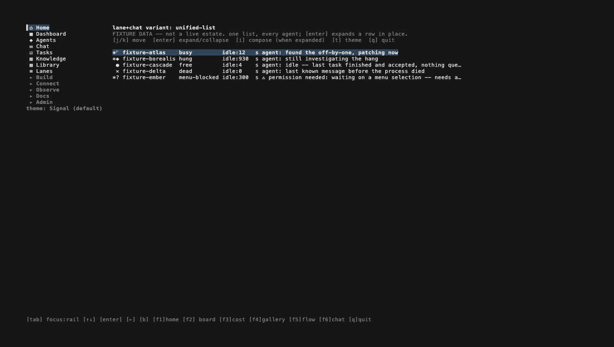
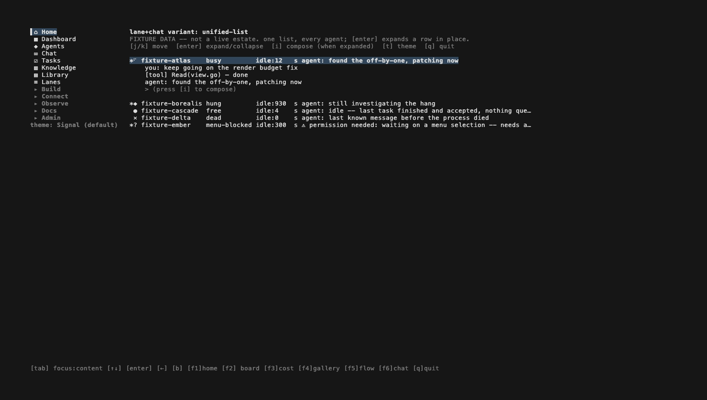
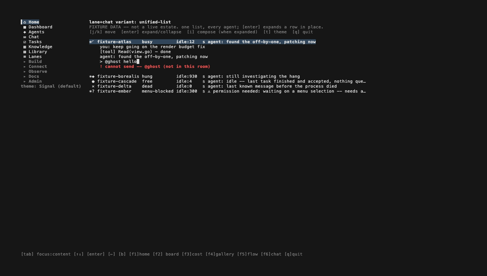

# agent-tui#122 follow-up: lanechat variant screenshots

Three real, working screens for the combined Lanes+Chat surface
(`internal/lanechat/{laneprimary,roomprimary,unifiedlist}`, agent-tui#115/#122),
captured so Jon can look at all three side by side instead of digging through
file paths or re-running the tapes himself. This doc **does not pick a
variant** — that decision is still his. See each tape for the full narration:
`testdata/vhs/lanechat-lane-primary.tape`, `testdata/vhs/lanechat-room-primary.tape`,
`testdata/vhs/lanechat-unified-list.tape`.

All 13 PNGs below are real Bubble Tea/lipgloss frames rendered by `vhs` over
`internal/lanechat`'s compiled-in fixture data (5 lanes spanning
busy/hung/free/dead/menu-blocked) — not mockups, and fully offline (no
supervisor repo, no ledger, no `cmd/fakemcp`).

## 1. Lane-primary — "the rail stays the spine, a conversation opens against the selected lane"

`internal/lanechat/laneprimary`: the narrow rail (left) lists every fixture
lane with its glyph and state; the right column shows exactly ONE
conversation at a time, whichever lane is selected.

| | |
|---|---|
|  | **01 — initial**: rail shows all 5 fixture lanes with real glyphs; `fixture-atlas` (busy) selected; right column shows its own 3-message thread. |
|  | **02 — selected hung lane**: after moving selection down, `fixture-borealis` (hung) is selected and its own long thread is on screen — proves the right column tracks rail selection, not a second independent list. |
|  | **03 — refused, unknown participant**: composing `@ghost are you there` is refused — `@ghost` is not a fixture participant at all. |
|  | **04 — refused, not running**: `@fixture-delta status?` is refused a different way — a real fixture lane, but its state is `dead`. |
|  | **05 — accepted, queued**: `@fixture-atlas ping` (real, busy) is accepted; status reads "queued (fixture — no live lane behind this room)" — never claims delivery. |

## 2. Room-primary — "one room per lane, with the lane's live state as room metadata"

`internal/lanechat/roomprimary`: one room per lane, 1:1. Every room row
carries the lane's own glyph, name, state and idle time inline, then a
transcript+composer below the list.

| | |
|---|---|
|  | **01 — room list**: every row shows glyph, name, state, idle seconds and a last-message preview on one line — both `busy` and `hung` visible inline, not just a title. |
|  | **02 — selected dead room**: selection moved to `fixture-delta` (dead); its own transcript renders below the list. |
|  | **03 — refused, not running**: `@fixture-delta still there?` refused — the same @-mention gate, proven in this variant's own layout. |

## 3. Unified-list — "lanes and threads as one list of 'agents you can talk to', state and conversation on the same row"

`internal/lanechat/unifiedlist`: one flat list, no persistent second pane.
`[enter]` expands a row in place (accordion) to show its transcript+composer,
pushing later rows down.

| | |
|---|---|
|  | **01 — collapsed**: every row is one line (state + preview only). |
|  | **02 — `[i]` no-op while collapsed**: pressing `[i]` on a collapsed row does nothing — identical to 01, proving compose requires an expanded row first. |
|  | **03 — expanded**: `[enter]` expands the first row in place — its transcript and an empty composer appear indented under that row; later rows are still visible, just pushed down. |
|  | **04 — refused, unknown participant**: `@ghost hello` inside the expanded row is refused. |
|  | **05 — collapsed again**: two `[esc]` presses (close composer, then collapse the row) return to the same one-line-per-row view as 01. |

## Regenerating

```
go build -o /tmp/atui-lanechat-lp ./cmd/estate && vhs testdata/vhs/lanechat-lane-primary.tape
go build -o /tmp/atui-lanechat-rp ./cmd/estate && vhs testdata/vhs/lanechat-room-primary.tape
go build -o /tmp/atui-lanechat-ul ./cmd/estate && vhs testdata/vhs/lanechat-unified-list.tape
```

Tapes write to `testdata/vhs/out/` (gitignored, scratch); the copies embedded
above live in `testdata/vhs/output/lanechat-*/` (not gitignored — committed so
this doc renders from a durable path).

## Not decided here

Which of the three — lane-primary, room-primary, or unified-list — becomes
the actual combined Lanes+Chat surface is unchanged from #122: a taste
decision left to Jon looking at the frames above. Nothing here wires a
variant into `internal/nav` or `internal/shell`'s default routes, and this
doc does not recommend one.
