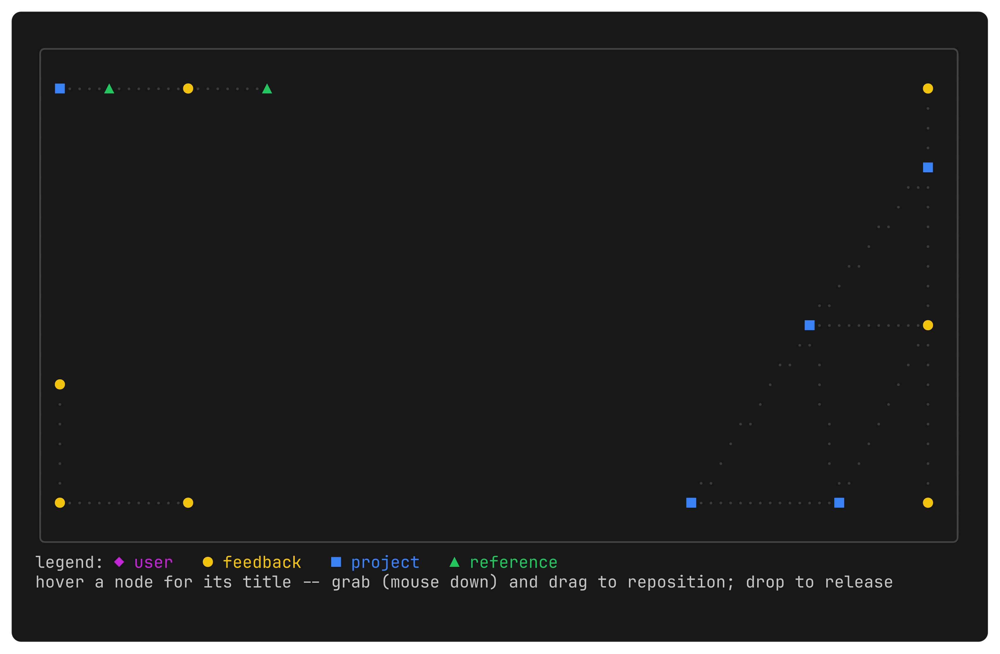
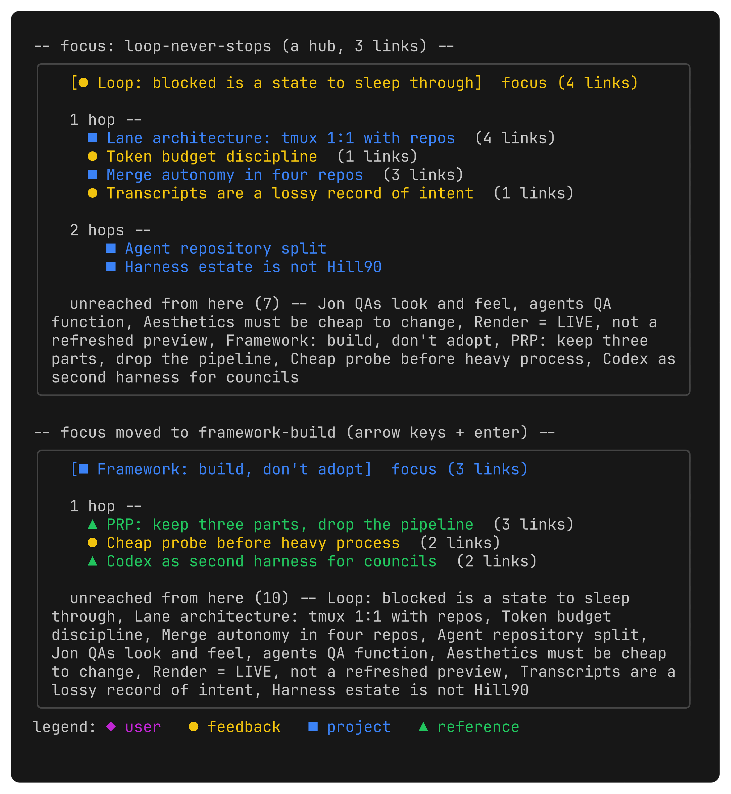
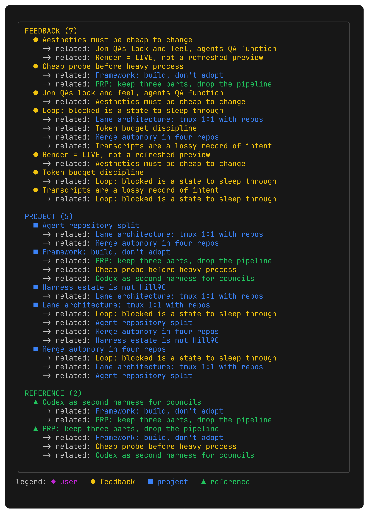

# agent-tui#61: knowledge graph view of agent memory -- variants + spike

**The issue's own gate is still real.** #61 is filed BACKLOG, "do not
start this," depends on OKF v0.2 (provenance/freshness/lifecycle/trust
fields) and the memory-scoping design. Checked against the vault as of
2026-08-20: `$AGENT_MEMORY_VAULT/agent/index.md` still declares
`okf_version: "0.1"`, no fact records a v0.2 adoption, and no fact
describes a memory-scoping decision (`grep -ril memory-scoping
agent/facts` and `grep -ril "progressive disclosure" agent/facts` both
came up empty -- the phrase only appears in raw, unresolved corpus
prompts). Both dependencies are open. This work was dispatched anyway
(PHASE 4, explicit) as a spike/variant pass, not as the feature landing --
nothing here is wired live, same discipline as agent-tui#62/#63's own
`tools/uivariants`.

**#61 also carries a live correction worth restating here**: the issue's
claim that a graph "might be the first feature that argues for the web
frontend" cited a parameter (`future=survives-web-frontend`) that a later
comment on the same issue struck as invented -- zero corpus hits for
"survives" or "web frontend" across 1,968 typed turns. Any web-vs-terminal
argument below stands on its own engineering merits, not on that claim.

## Prior art: Hill90's graph, read before designing anything

`services/ui/src/app/harness/shared-knowledge/KnowledgeGraph.tsx` --
d3-force (`forceManyBody`, `forceLink`, `forceCollide`, `forceX/Y`) driving
node positions, drawn on an HTML canvas with layered glow, gradient edges,
sub-pixel idle drift, and real pointer drag (`pointerdown`/`pointermove`
distinguishing a 5px/400ms click from a drag). What carries over to a
terminal: the force-layout algorithm itself (spring embedder over
nodes/edges, cheap to reimplement without d3), degree-based node sizing,
type-based colour, hover/focus dimming. What does not: sub-pixel
positioning (a terminal has no cell smaller than a cell), the glow/blur
rendering (canvas alpha compositing, no analogue in a character grid), and
pointer drag at pixel resolution -- mouse events over a terminal resolve
to a CELL, not a pixel, so "grab and move" is inherently coarse compared
to Hill90's canvas. That gap is the reason this pass leads with a spike,
not a design.

## bubbles was checked before hand-rolling the layout

`bubbles` is not in go.mod (`grep bubbles go.mod` -- no hits) and, even
where vendored elsewhere, ships no graph/force primitive: viewport/
table/list are scrolling widgets, not layout. `tools/memoryvariants/layout.go`
is a ~90-line Fruchterman-Reingold spring embedder (same algorithm family
d3-force implements), not a library gap papered over.

**First half false as of `56513a2`, corrected 2026-08-23 (estate-loop/
b-docs-stale sweep, pass 2) — flagged but left unfixed by the prior sweep
pass (#119) as low priority given this doc's own throwaway-spike framing;
fixed now since the brief for this pass asks for every false claim
corrected, not just high-priority ones.** `bubbles` is now in `go.mod`
(`github.com/charmbracelet/bubbles v1.0.0`) — added for `internal/chat`'s
viewport-scrollable transcript/thread list (agent-tui#20), unrelated to
this spike. The second half of the sentence stands: `bubbles` still ships
no graph/force-layout primitive, so the point this paragraph is making
(hand-rolling the spring embedder was necessary, not a library gap papered
over) is unaffected.

## The spike: is mouse drag usable in Bubble Tea on a character grid?

`tools/memoryvariants/spike/` is a real interactive `tea.NewProgram` (not
a static frame) with `tea.WithMouseAllMotion()`, three nodes, and
press/motion/release wired straight to node position -- the minimal
version of Hill90's `onPointerDown`/`onPointerMove`/`onPointerUp`.

**Mechanism-level finding, verified**: `spike/main_test.go` drives
`Update()` with a synthetic press/motion/release sequence (the same shape
a real terminal's SGR mouse reporting delivers) and confirms a grabbed
node follows the cursor cell-for-cell, an ungrabbed motion event moves
nothing (the pan-vs-drag distinction Hill90's own canvas enforces), and
release lets go cleanly:

```
$ go test ./tools/memoryvariants/... -v
=== RUN   TestDragSequenceMovesGrabbedNode
--- PASS: TestDragSequenceMovesGrabbedNode (0.00s)
=== RUN   TestMotionWithoutPressDoesNotGrab
--- PASS: TestMotionWithoutPressDoesNotGrab (0.00s)
PASS
ok  	github.com/jonhill90/keelson/tools/memoryvariants/spike	0.643s
```

**Not verified, and said so rather than assumed**: real terminal
mouse-event rate/resolution and how a drag actually feels over tmux/SSH.
`tmux new-session` cannot start a server in this dispatch's sandbox --
`server exited unexpectedly` on every attempt, including a trivial `sleep
30` pane with no `keelson` involved at all, with and without the sandbox
disabled. This is an environment limitation, not a finding about the
spike itself. **Whoever picks this up next needs one real terminal
session** (`go run ./tools/memoryvariants/spike`, drag a node, watch
`grabbed=`/`events=` in the status line, read the event log this prints
to stderr on quit) to close this gap -- the Go-level mechanism is proven,
the human-feel question is not.

## Three variants, three different answers to "what does grab-and-move mean here"

Fake, INVENTED data shaped like the real vault (`agent/facts/*.md`, typed
user/feedback/project/reference, `Related: [[wikilink]]` edges) --
titles/edges are made up for this spike, not Jon's actual fact content,
which is private and does not belong committed into a public repo (see
`tools/memoryvariants/graph.go`'s doc comment).

| | |
|---|---|
|  | **1. Grid** -- the literal Hill90 reading: every node placed by the spring layout on a shared cell grid, edges drawn as dotted lines, a node grabbed and dragged (see spike/ above). Implies: closest to what Jon asked for and the only one showing the whole graph at once, but cell-snapped movement is coarse next to Hill90's sub-pixel canvas, and this specific fake graph's layout is sparse/corner-heavy at 200 iterations -- the embedder's constants need tuning against the real vault's actual density before this reads as "settled," not "scattered." |
|  | **2. Orbit** -- no free-form drag: one node is FOCUS, its neighbours ring around it by hop distance, arrow keys re-centre. Implies: cheapest to build and read (a hub with N spokes never overlaps), but you only ever see one node's neighbourhood, never the whole graph -- the "grab-and-move isn't the right primitive here" answer. |
|  | **3. Outline** -- not spatial at all: grouped by OKF type, each fact's related links nested one level under it. Implies: zero layout/physics/drag code, the natural next step is `bubbles/viewport` for scrolling (the same fix agent-tui#29 needs for the board), reads fastest for "what relates to X" -- but it's a list, not the grabbable graph Jon actually asked for, which is the honest "the terminal wants a list here" answer to the issue's own open question. |

## Follow-up: the fixture's data model was OKF-shaped, now genericized

A gate check on this issue (before any further view work resumed) found
`tools/memoryvariants/graph.go`'s node/edge model, not just its demo
content, was candidate-shaped rather than generic: node `typ` was a fixed
four-value OKF enum and edges had no room for a weighted similarity link
-- building the draggable view against it as-is would have been a soft
vote for OKF markdown+wikilinks before #116 (reserved for Jon) picks a
storage format.

That model is now candidate-neutral: `node.typ` is an open-ended string
(`""` for uncategorized, any tag a caller wants), and `edge.weight` is an
optional float, zero-value for a plain binary link. `graph_test.go`'s
`TestGenericModelFitsNonOKFCandidate` builds a second graph shaped like
#116's candidate 2 (vector-embedding neighborhoods -- opaque cluster-id
types, real similarity weights) through the exact same `graphData`/
`node`/`edge` types the OKF-shaped demo below uses, with no special case
for either shape. `colorFor`/`glyphFor` (`main.go`) render any type tag,
known or not, falling back to a deterministic hash-derived color/glyph --
the same device Hill90's `KnowledgeGraph.tsx` uses for an unrecognized
type.

The three variants below, and their PNGs, are unchanged: `fakeGraph()` is
now one CALLER of the generic model rather than the model itself, still
building the same 14-node/15-edge OKF-shaped scenario (pinned by
`graph_test.go`'s `TestFakeGraphUnchangedShape`). Regenerating the PNGs
against the new model reproduced byte-identical output to what was
already committed here -- genericizing the types changed nothing a
viewer of these images can see. No storage format was picked; no view
code changed.

## Scope: one graph or one per project

Untouched here on purpose. #61 says the graph must render whatever the
memory-scoping work decides "which memories belong to this project"
means, not invent its own answer -- and that work has not landed (see the
gate check above). All three variants above render one undifferentiated
graph; the scoping question stays open until that dependency resolves.

## Regenerating

```
./scripts/render-memoryvariants.sh
```

Requires `go` and Charm's `freeze` on `PATH`. Writes the three static PNGs
into this directory; does not touch `spike/`, which needs a live terminal
(see above).

## Disposition

`tools/memoryvariants/` (including `spike/`) is throwaway -- hardcoded
fake data, no live wiring, not imported by `cmd/` or `internal/`, same
discipline as `tools/uivariants/`. Once a variant (or none) is picked and
the two gate dependencies land, it gets rebuilt as a real `internal/`
package against a live vault-reading seam; nothing here gets promoted
as-is. Delete `tools/memoryvariants/` and this directory once the pick is
made.
